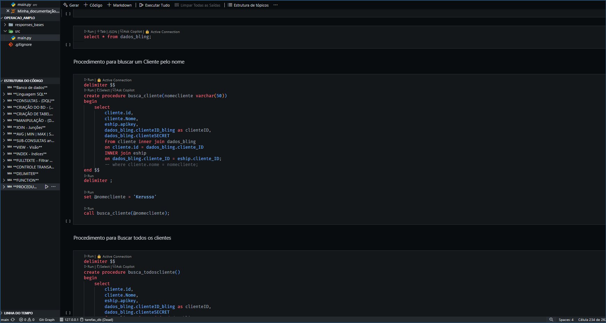

# Projetos que desenvolvi
___________________________________________________________________
## 1 - Rastreados do objetos BusLog Via API

https://github.com/datocarneiro/Rastreador_de_Objeto_Buslog-API-
### _Tecnologia:_ 🎯 Python, API Requests , Pandas, Json, Tkinter.
  
Nesse projeto atuei como `Desenvolvedor`, construindo uma aplicação que pudesse Gerar encomendas, Cotar (em massa) e  rastrear de forma eficiente.
Então com base na documentação `API` enviada pela transportadora, desenvolvemos a aplicação e trazendo o resultado esperado de forma praticamente instantânea.

_______________________________________________________________________
## 2 - Rastreados do objetos LATAM

[https://github.com/datocarneiro/Rastreador_de_Objeto_Buslog](https://github.com/datocarneiro/Rastreador_de_Objeto_Latam-automacao-)
### _Tecnologia:_ 🎯 Python, Selenium, Openpyxl, Flask, Html, CSS
  
Nesse projeto atuei como `Desenvolvedor`, construindo uma aplicação que pudesse rastrear encomendas de forma eficiente. 
Sem a documentação API, criei um `WebScraping`, onde pelo navegador o usuario pode carregas um arquivo excel com com as encomendas que precisavam ser rastreadas

______________________________________________________________________
## 3 - Sortear times equilibrado

https://github.com/datocarneiro/Sortear_times
### _Tecnologia:_ 🎯 Banco de dados em Nuvem(postgree) gerenciado pelo Dbeaver, Python, CI/CD, Flask, Html, CSS
  
Nesse projeto atuaei como `Desenvolvedor`, contruindo um sorteador de times
Essa aplicação veio da necessidade do nosso Time de futebol das peladas do fim de semana rsrs, tinhamos dificuldade para gerenciar tanto o controle de quem confirmasse presença e da divisão equilibrada das duas equipes, então tive a ideia

nela o proprio jogador , confirma sua presença. e a divisão do time é feito com todo uma logica considerando , nivel de jogador e posição de atuação

o resultados ficou muito bom :)

planejamos outras versão incluindo a versão app.

______________________________________________________________________
## 4 - Dashboard de expedição

https://github.com/datocarneiro/Dashboard_Expedicao_v1.2
### _Tecnologia:_ 🎯 Python, Selenium, Pandas, Openpyxl, Flask, Html, CSS.

Nesse projeto atuei como `Desenvolvedor`, Construindo uma dashboard de expedição.

A Amplo logistica é uma empresa que atende varios clientes, e que muitas vezes esses clientes acabam usando o `mesmo Transporte`, 
assim veio a necessidade de uma `Dashboard de Expediçao`que fosse capaz de agrupar isso envolvendo todos os clientes da Amplo.

cada transportadora tem seu horario de Corte, então era necessario esse `controle visual para melhor gestão de tempo dos operadores`, evitando atrasos desnecessarios pela logística.

_______________________________________________________________________
## APlicação para Reservas de datas (in memorian)

https://github.com/datocarneiro/Reservar_Data/tree/main/Reserva_Data
### _Tecnologia:_ 🎯 Python, Json, Flask, Html, CSS.

❤ `Esse é um projeto muito especial pra mim` ❤

Ele nasceu em uma necessidade não muito boa, quando minha Vó se encontrava inferma

Com a dificuldade de controlar os dias em que cada familiar poderia ficar dando asistencia para oas cuidados para com a nossa querida Vózinha, Crie uma aplicação onde fosse possivel ser acessada pela WEB, e salvasse um `banco de dados` simples nesse caso o banco estava em um Json. 

A Aplicação foi feita o deploy na plataforma replit, então o acesso estava disponivel pra todos.

A aplicação foi um sucesso, e atendeu o que se esperava, até que nossa `querida VÒ HILDA`, foi para o céu. 

_______________________________________________________________________
## Banco de Dados

https://github.com/datocarneiro/DATABASE/blob/main/Minha_documenta%C3%A7%C3%A3o.ipynb
### _Tecnologia:_ 🎯 MySQL

Aqui alguns estudos em banco de dados utilizando MySQL

_______________________________________________________________________

